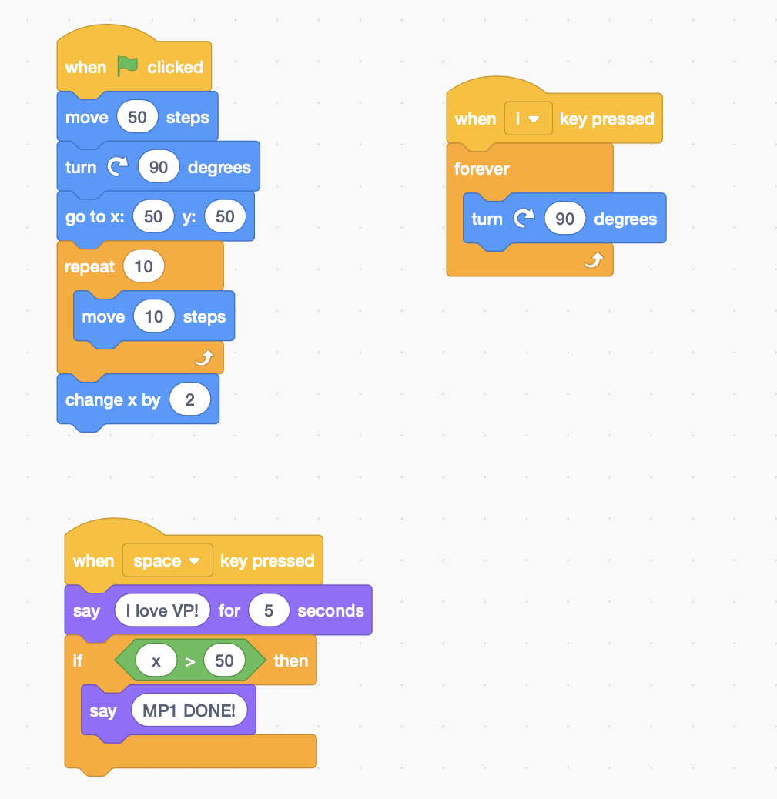

# Visual Programming: Source-to-Source Transformation

A NodeJS program that transforms a [Scratch](https://scratch.mit.edu/) visual program to a textual representation.

## Installation and Build

* Clone/Download the Code.
* Make sure [Node](https://nodejs.org/en/) is installed.

* Install the dependencies:
```node
npm install
```

## Running the program
```
npm start <pathToScratchProjectJSON>
```
The transformed pseudo code will be displayed in the console.

### Writing the pseudo code to file
To write the pseudo code to a file, an optional file path can be passed as a command line argument.
```
npm start <pathToScratchProjectJSON> <optionalOutputPath>
```
## Examples

The following are sample projects, that can be found under the `./scratch-projects` directory.

### Sample Scratch Program

To generate the textual representation of the sample scratch program, change the directory to the root of this project then run the following command:
```
npm start ./scratch-projects/sample-program.json
```

#### Scratch Program


#### Transformed Pseudo code Program
```
WHEN Green Flag CLICKED
  BEGIN
    Move 50 Steps
    Turn right 90 Degrees
    Go to 50,50
    REPEAT 10 TIMES
      BEGIN
        Move 10 Steps
      END
    Change X by 2
  END
WHEN space PRESSED
  BEGIN
    Say I love VP! For 5
    IF (x>50)
      BEGIN
        Say MP1 DONE!
      END
  END
WHEN i PRESSED
  BEGIN
    FOREVER
      BEGIN
        Turn right 90 Degrees
      END
  END
```
